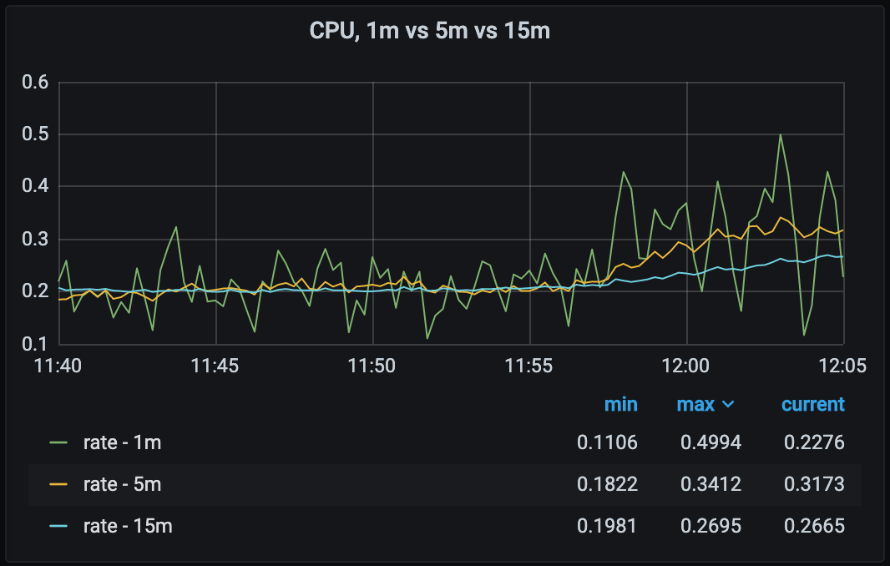
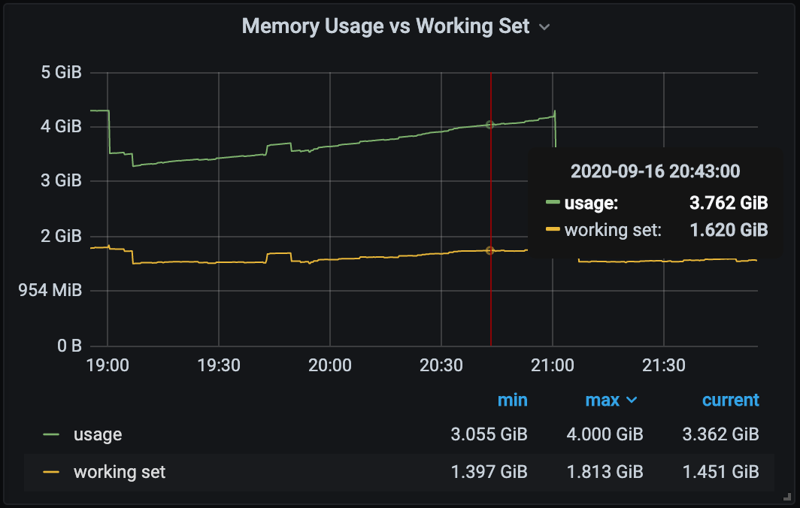

# [OBSV-101] 可观测性：概念和最佳实践

可观测性在社区中是一个几乎有些被滥用的名词。像很多老生常谈的技术概念一样，很多人往往在真正理解这个概念的定义并理解一些基本原则前就已经在大量使用它了。本偏笔记围绕可观测性，对这一领域的一些基本概念进行剖析分解。基于这篇笔记，老手可以基于此对自己的经验进行一次梳理和总结，新手可以做一个快速入门。

## 基本概念

做工程时往往无法做到做科学时的严谨，因此一些基本概念的定义往往不那么黑白分明。但这里我们还是尽力给一些基本概念做一个定义，以便高效沟通。

### 可观测性 vs 监控

可观测性（observability）可以理解为 “一个系统可以通过输入和输出推断其内部状态的能力”。注意，可观测性并不等于监控（monitoring）。监控指的是更具体的一套行为，通常涉及采集、处理、聚合、和展示实时的、可量化的数据，比如 API 接口的响应延迟，节点的内存余量，服务的异常状态等。监控告诉你一个系统是否正常运作，是达到良好可观测性的必要手段；可观测性除了告诉你系统是否正常运作，还帮你理解一个系统为什么如此运作。

### 白盒监控 vs 黑盒监控

白盒监控（white-box monitoring）关注的是一个系统的内部运行指标，例如日志，内存消耗，线程数等。黑盒监控（black-box monitoring）关注的是一个系统面对它用户的表现，例如 API 是否可调用，页面是否可正常访问等。换句话说，白盒监控关注病因，而黑盒监控关注症状。两者有截然不同的适用场景以及最佳实践。后文详谈。

### 症状 vs 病因

症状（symptoms）和病因（causes）这两个概念可能不像大多数人想象的那么简单。最重要的点是，在一个多层级的系统中，症状和病因是相对的；一个问题在系统中的某一层可以是症状，而在另一层中则可以是病因。举例，“API 返回服务端错误” 对于调用方来说是病因，对于后端服务来说则是症状。

## 监控数据的形态

总的来说，所有监控数据关注的点都是事件。一个事件可以是一个 HTTP 请求，代码中的一行代码的执行，或是节点的内存用量达到了一个特定的值。在监控这些事件时，我们必须要关注的信息是事件的上下文。对所有事件记录大量上下文又是不切实际也没有必要的。因此，当我们关注一个事件时，我们必须要明确的是，我们需要多详细的上下文？在明确了这一点后，我们就可以选择一个在满足需求前提下、成本最低的数据形态来记录事件和上下文。

### 指标/时序数据

指标（metrics）指带有一些系列元数据的时序（timeseries）数据。时序数据相对其他数据形态来说，最轻量、使用成本最低，但能够表达的上下文也最少。指标一般被运用在告警场景和趋势观察场景。

> Tip: 时序数据可以被轻松地计算、聚合（aggregate），采集指标时一般只采集最细维度的数据，再通过聚合得到粗维度的数据。举例，如果我们采集了所有容器的内存用量，那么就可以把一个分区内所有容器的内存用量相加得到分区用量，不需要单独采集分区用量。

在绝大多数监控系统中，指标可以被分为以下三类：

#### Counter

特点是只增不减。除了天生只增不减的数据外，还常用于波动剧烈的数据。以 CPU 举例，由于 CPU 抖动过于剧烈，通常我们使用 X 分钟秒均值展示，以便人类理解。使用 counter，我们可以只记一个指标，通过这个指标来计算 X 分钟秒均值。举例，如果我需要 5 分钟秒均值，取两个相差 5 分钟的 sample，取其差值除以五分钟即可。此外，counter 在使用一些常见的时序数据压缩方式时，比如 Facebook 的 Gorilla 系统使用的 double delta compression，可以被非常高效地压缩。

上图展示了同一个 counter 数据计算出的 1 分钟秒均值、5 分钟秒均值、和 15 分钟秒均值

常用指标：CPU 用量，网络流量，请求量

#### Gauge

特点是可增可减。如果数据波动稳定，gauge 可以比 counter 更精确地表达时序数据如何随时间增加或减少。另外一个常见用法是用 gauge 表达资源状态，把所有可能的状态对应到一个固定的数字上。

常用指标：内存用量，硬盘空间，服务运行状态

#### Histogram

Counter 指标的一个主要问题是，它只能被计算为均值。而对于类似接口请求延迟的数据，仅仅有平均值还不够。我们往往还需要看到数据的分布情况，甚至计算[百分位数](https://baike.baidu.com/item/百分位数/10064171?fr=aladdin)（quantile）。对于这类数据，我们需要更复杂的计量方式：histogram。Histogram 的原理是提前定义多个 buckets，覆盖所有可能的样本；采集到新样本时，这个样本会落入某个 bucket 内。使用时，我们可以利用样本在各个 bucket 的分布情况计算 quantile。展示时，histogram 尤其适合绘制火焰图（heat map）。

常用指标：各类延迟、耗时类指标

### 事件型数据

事件型数据值的特点是，一个或一组带有相同元数据的数据样本可以相对完整地描述一个事件。日志是最常见也是形态最简单（除元数据外只是一个字符串）的事件型数据。更复杂的例子有 Kubernetes 的 Event。事件型数据一般带有一些基本的上下文信息。

事件型数据的储存成本高于指标，但如果使用得当，成本一般仍能控制在可大规模采集的范围内。传统上，事件型数据一般被用于调试场景，而近几年，随着性能和成本的问题被解决得越来越好，也被越来越多的运用到告警和趋势观察场景。业界中日志系统的旗舰之一，[Elasticsearch](https://www.elastic.co/elasticsearch/)，甚至在做基于事件型数据而不是时序数据的指标解决方案。

### Tracing

Tracing 可以被认为是一组元数据不同，但关联对象上存在共性，并且强调时间上的先后顺序的事件性数据的合集。它可以是组件内的，比如沿某个线程收集的一组带时间戳的日志，也可以是跨组件的，比如一个前端请求在最终返回前触发的一些列后端请求。

Tracing 能提供非常丰富的上下文，但也有明显缺点。首先，tracing 的采集和储存成本一般很高。Richard Hartmann (Monitoring Lead from SpaceNet) 在他的 [Observability 101](https://archive.fosdem.org/2019/schedule/event/on_observability_2019/) 讲座中提到，tracing 数据的采集在生产环境中一般是默认关闭或仅小规模采样的，仅在发生问题时才按需打开。其次，tracing 的使用难度也更高，但这一点正在随着各种 [RPC](https://en.wikipedia.org/wiki/Remote_procedure_call) protocols 和例如 [Jaeger](https://www.jaegertracing.io/) 的 tracing 工具的推广而改善。总的来说，tracing 一般只适合调试场景。

## 最值得关注的指标

有了数据，那么该从哪些维度切入、评估一个系统呢？对于这个问题，大部分工程师能针对具体问题给出很好的具体答案，但却不能给出一个选择指标的方法论，也因此在面临陌生问题或/和海量数据时感到无从下手。要总结一套解决这个问题，我们可以先总结一些最值得关注的指标的类型，然后在面对每个新的监控对象时思考，这个对象有哪些状态信息可以嵌套进这些指标类型中去的。下面我们看几套自知名机构或业界大牛总结的最重要的指标类型。

### The Four Golden Signals

The Four Golden Signals 是 Google 在 [Google SRE Handbook](https://landing.google.com/sre/sre-book/chapters/monitoring-distributed-systems/) 中提出的概念。相对其他几种方法，笔者认为这种方法适用面最广、最实用。The Four Golden Signals 指出了四类最值得关注的指标：

- Latency - 耗时
  - Google 的原文里这里特指请求耗时，但其实耗时在各类操作来说一般都是关键指标。例子包括 HTTP 请求耗时，磁盘读写操作耗时，function 执行耗时等。
  - 原文中特地强调了耗时应该按成功请求和失败请求分别统计，因为成功请求和失败请求的耗时的意义全完不一样。
- Traffic/Load - 负载
  - Google 原文中这里的用词是 Traffic，但其表达的意思更接近大部分所理解的负载，即描述监控对象承载压力大小的值。比如带宽的占用量，服务的 QPS，或磁盘的 IOPS。CPU 负载也可以归于此类。
  - 注意负载特指绝对值而不是利用率，两者的运用场景不一样。负载关注的具体压力的大小，跟能承载的上限无关。两者都很重要，需要能够分别统计。
- Errors - 错误率
  - 非常好理解，即操作失败的频率和比例。
  - 错误的定义不一定是绝对的（explicit），也可以是含蓄的（implicit）或基于策略的（policy）。举例，请求返回 500 是 explicit error，请求返回 200 但返回内容不符合预期是 implicit error，而请求耗时超过预期的 1 秒则是 policy error。一个监控系统需要明确自己适合用来监控哪类错误。
- Saturation - 饱和度
  - 和 Traffic 类似，用于描述负载，但区别是饱和度关注的是负载有满，而不是绝对值有多高。
  - 饱和度指标的关键在于表达监控对象当前的负载举例饱和或崩溃还有多远，并不绝对指利用率。
  - 利用率看似简单，要用好其实技巧很多：
    - 利用好 Histogram 类指标，观察高百分位值（比如 P90）能够帮你尽早地捕捉到监控对象临近饱和的信号。举例，使用请求延迟的 P90 值作为分子，超时时间作为分母，来计算请求时常饱和度。
    - 饱和度的发展趋势和当前饱和度比一样重要，有时甚至更重要。
    - 试着让你定义的饱和度描述 “系统距离彻底饱和还有多远”，而不是把所有资源利用率都归类于饱和度。举个例子，内存中，我们可能会把 resident memory + page cache 作为分子、内存总量作为分母来定义为内存饱和度。但这里要考虑到 page cache 里有很大一部分是可以在内存压力下被释放的，因此更好的分子是 resident memory + page cache - inactive file。两种分子，使用前者的含义更接近利用率，而后者更接近饱和度。

上图中是一个数据库服务的内存用量，绿为 rss + cache，黄为减去 inactive file，两者相差甚远

下面的几种方法里出现的指标类型都能在 The Four Golden Signal 中找到对应的类型，所以我们不再做细致分析。

### The USE Method
T
he USE Method 是 Brendan Gregg（Netflex 架构师）在他的博文里提出的指标分类方法。这套方法比较关注资源。

- Utilization，利用率，接近 The Four Golden Signal 里的饱和度。两者的区别已在上文中陈述。
- Saturation，饱和度，对标 The Four Golden Signal 里的饱和度。
- Errors，错误率，对标 The Four Golden Signal 里的 Errors。

### The RED method

The RED method 是 Tom Wilkie（Kausal，即发布 Promethues 和 Cortex 的公司，的创始人）在 KubeCon 2017 讲座中提出的指标分类方法。这套方法比较关注请求和响应请求的服务。

- Rate，频率，对标 The Four Golden Signal 里的 Traffic。
- Errors，错误率，对标 The Four Golden Signal 里的 Errors。
- Duration，耗时，对标 The Four Golden Signal 里的 Latency。

## 监控最佳实践

监控的最佳实践学而无尽。作为一篇入门级的笔记，这里少量列举几个重要又好理解的。哪怕你的日常工作不需要你应用这些最佳实践，了解它们仍能帮你加深对可观测性这个大课题的理解。

### 数据采集：质量 vs 数量

监控的重点应该是监控什么，为什么监控，怎么使用监控到的信息，而不是把能收集到的信息都囤积起来。

> Data lake: a single repository for all your raw unstructured, semi-structured, and structured data

所有监控数据，在实际为使用者提供有价值的上下文信息前，都只产生储存成本和噪音。存储成本非常好理解，不展开。关于噪音我们做一些展开。大部分去监控系统里查询数据的人对系统里的数据的熟悉程度往往远不及监控系统的搭建者，有的甚至对系统本身也只有有限的理解。他们往往带着问题来，却不知道怎么提出，因此经常会有一个翻阅的过程。在一个庞大的数据库中翻阅指标就好比从一本厚厚的菜单中点菜，即使有索引，当菜单厚到一定程度时依然会让使用者感到无所适从。除了数量的因素外，还有质量的因素。当我们没有给数据添加足够的元数据时，对数据的检索、关联、聚合、计算就变得格外困难。当数据堆积成一个数据湖（data lake）而又缺乏一个有效的检索能力，有价值的数据也会贬值。

综上所述，监控系统的使用者应该把更多的注意力放在如何为已知有效的数据提供尽可能多的元数据（即上下文），而不是堆积数据。一个判断数据是否有足够价值的方式是给一个毫无相关背景的人解释你为什么要收集你正在收集的数据，以及你打算怎么用它；如果你没有办法很好地解释，那么你大概率不应该收集这份数据。

注：在像机器学习这种大部分数据都能被解析出信息场景不属于上述范围，因为数据实际产生了价值。

### 告警：避免噪音

告警最核心目的是通知人类来修复问题。因此，在一套合理的 SRE 流程里，每一个潜在的告警都应该对应一个明确的响应流程。这意味着噪音，即低价值告警、重复告警、和误告警，对整套流程的侵害是很大的。如果告警人员不断地接收到噪音，这会给响应流程落地带来阻力，给响应人员增加工作成本，拖慢响应时间，甚至造成狼来了效应、导致响应人员忽视重要的告警。

和数据采集一样，关注告警的质量而不是数量。合理使用告警等级机制来区分低优和高优告警，为不同的优先级制定不同的通知方式和响应流程。

### 少用黑盒监控 & 关注病因

继续“告警最核心目的是通知人类来修复问题”这一理论：此处有一个关键词是修复。这意味着接到报警时，响应人员需要弄清两件事：到底哪里出了故障？我如何确定我修复的是病因而不是症状？因此我们会希望每一个告警通知都尽量为这两个问题提供足够的信息，或者起码告诉响应者从哪里入手去寻找这些信息。换句话说，我们应该尽可能多的使用暴露系统内部状态的白盒监控，并在监控通知里放入尽可能多的上下文甚至，如果可能的话，一个初步诊断。这在运维人员和开发人员对一个系统的理解差距较大时尤其有价值。

黑盒监控也有它的价值，但这价值一般是对老板的：黑盒告警的触发一般意味着故障已经带来实际损失，也就是说管理层可能需要介入、责任需要到人。但这对排除故障、分析问题来说一般毫无价值。甚至对发现问题一般也没有价值：一个可靠性合理的系统应该在触发黑盒告警前，经历至少几层的故障和保险，能够提前释放出信号来帮运维人员预判风险。

### 自动化

上面提到了几次告警要通知到人来修复，这个说法其实有一个瑕疵：修复问题的除了人还可以是程序，或者说，应该是程序。

通过程序自动修复故障显然是收益和门槛很高的，这个话题本身值得一篇专门的笔记。作为一篇入门笔记这里不展开具体的技巧，仅划几个重点：

1. 一套系统能应对的并发故障的规模约等于它的自愈能力。人肉修复故障是难以 scale up 的。
2. 以研发，而不是运维的心态看待自动化这件事。尽可能得在系统的架构设计阶段，而不是在维护阶段，来考虑如何自动化。
3. 单一系统（比如一个数据库）的自愈往往可以在内部做好，但一套复杂系统的自愈往往不能离开监控告警系统。

### 无责任复盘

严格地来说这不是一个监控的最佳实践，而是一个团队管理的最佳实践。但由于跟监控息息相关且十分重要，所以也写在这里。

再可靠的系统也可能崩溃；再完善的监控系统也有未能覆盖的功能点。事故总是会发生，而能突破层层防线最终造成严重后果的事故，无论在人的层面还是技术的层面，原因往往都不简单。因此，我们需要在事故处理完毕之后，通过复盘来把各个层面的问题暴露出来，以便杜绝后续事故再次发生的可能。从关注病因而不是症状的角度来看，也许这也可以被理解为是监控的一个环节。

然而此处有一个明显的矛盾点：一个有意义的复盘的基本条件是对事故的原因做清晰、彻底的剖析，而得到的事故原因，往往能追究到人。大部分时候，这些需要承担责任的人，往往也是最了解系统、因此最有能力分析问题的人。如何让他们愿意坦诚清晰地把问题暴露出来？很多优秀的公司和大牛都对这个问题提出了一个共同的答案：无责任复盘文化（blameless postmortem culture）。通过彻底解除复盘参与人的担责负担，来获得最清晰的复盘结果。

把无责任复盘文化做好并不是一件简单的事。好在网上关于无责任的方法论也非常丰富。Google SRE Handbook 里有专门的[章节](https://landing.google.com/sre/sre-book/chapters/postmortem-culture/)，也可以参考一些[文章](https://www.atlassian.com/incident-management/postmortem/blameless#:%7E:text=In%20a%20blameless%20postmortem,%20it's,on%20improving%20performance%20moving%20forward.)或[书籍](https://www.linkedin.com/pulse/work-principle-3-create-culture-which-okay-make-mistakes-ray-dalio)，我们在此不做展开。

> Create a culture in which it is okay to make mistakes and unacceptable not to learn from them.  
> - Ray Dalio \<Principle\>

## 参考资料

- [Observability 101](https://archive.fosdem.org/2019/schedule/event/on_observability_2019/), a FOSDEM presentation by Richard Hartmann
- SRE Handbook ([Chapter 6, Monitoring Distributed System](https://landing.google.com/sre/sre-book/chapters/monitoring-distributed-systems/)), a book by Google Inc.
- [The USE Method](http://www.brendangregg.com/usemethod.html), a blog post by Brendan Gregg
- [The RED Method](https://www.youtube.com/watch?v=TJLpYXbnfQ4), a KubeCon presentation by Tom Wilkie