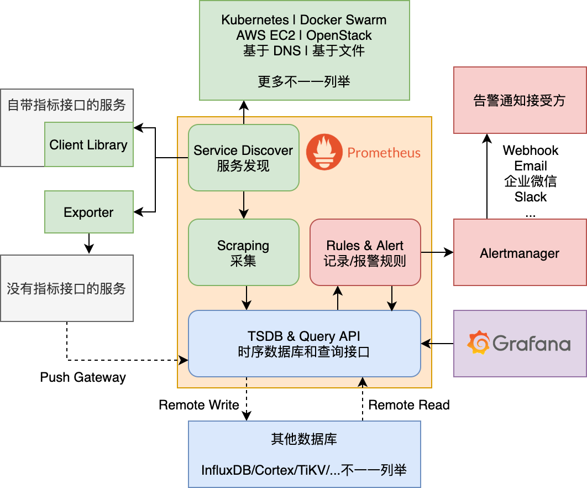

<!-- START doctoc generated TOC please keep comment here to allow auto update -->
<!-- DON'T EDIT THIS SECTION, INSTEAD RE-RUN doctoc TO UPDATE -->
# [PROM-101] 初步认识 Prometheus

- [Prometheus 是什么](#prometheus-%E6%98%AF%E4%BB%80%E4%B9%88)
  - [指标采集和服务发现](#%E6%8C%87%E6%A0%87%E9%87%87%E9%9B%86%E5%92%8C%E6%9C%8D%E5%8A%A1%E5%8F%91%E7%8E%B0)
  - [时序数据库](#%E6%97%B6%E5%BA%8F%E6%95%B0%E6%8D%AE%E5%BA%93)
  - [告警引擎](#%E5%91%8A%E8%AD%A6%E5%BC%95%E6%93%8E)
  - [Prometheus 不是什么](#prometheus-%E4%B8%8D%E6%98%AF%E4%BB%80%E4%B9%88)
- [项目现状和生态](#%E9%A1%B9%E7%9B%AE%E7%8E%B0%E7%8A%B6%E5%92%8C%E7%94%9F%E6%80%81)
- [基本架构详解](#%E5%9F%BA%E6%9C%AC%E6%9E%B6%E6%9E%84%E8%AF%A6%E8%A7%A3)
  - [数据源：Client Library 和 Exporters](#%E6%95%B0%E6%8D%AE%E6%BA%90client-library-%E5%92%8C-exporters)
  - [存储：TSDB 或外部存储](#%E5%AD%98%E5%82%A8tsdb-%E6%88%96%E5%A4%96%E9%83%A8%E5%AD%98%E5%82%A8)
  - [数据展示](#%E6%95%B0%E6%8D%AE%E5%B1%95%E7%A4%BA)
  - [告警：Alerting Rule 和 Alertmanager](#%E5%91%8A%E8%AD%A6alerting-rule-%E5%92%8C-alertmanager)
- [常见问题](#%E5%B8%B8%E8%A7%81%E9%97%AE%E9%A2%98)
  - [架构中没有消息队列吗？](#%E6%9E%B6%E6%9E%84%E4%B8%AD%E6%B2%A1%E6%9C%89%E6%B6%88%E6%81%AF%E9%98%9F%E5%88%97%E5%90%97)
  - [推 vs 拉](#%E6%8E%A8-vs-%E6%8B%89)
- [参考资料](#%E5%8F%82%E8%80%83%E8%B5%84%E6%96%99)

<!-- END doctoc generated TOC please keep comment here to allow auto update -->

<!-- doctoc --maxlevel 3 --title "# [PROM-101] 初步认识 Prometheus" prometheus/PROM-101.md -->

---

前置阅读：[[OBSV-101] 可观测性：概念和最佳实践](https://github.com/lichuan0620/k8s-sre-learning-notes/blob/master/prometheus/PROM-101.md)

这篇笔记从零开始介绍开源监控引擎 Prometheus（普罗米修斯），从功能，基本用法，和社区地位几个维度帮读者快速理解这个项目的特性和优缺点。

文档基于 Prometheus 2.x 版本编写。

## Prometheus 是什么

[Prometheus](http://prometheus.io) 是一个开源的指标监控引擎。它的特点是专门为监控场景优化，用大胆的功能取舍换取了极佳的性能。尽管 Prometheus 的功能并不丰富，但在它选择做的事情上，它做得都非常好。这一特点帮它在开源社区里打下了很高的地位，很多它不能做的事，都能在社区中找到成熟的插件或拓展方案。基于 Prometheus，我们可以构建一套功能性鲁棒性俱佳的指标监控体系。

首先，我们看一下 Prometheus 具体提供了哪些功能。

### 指标采集和服务发现

Prometheus 同时支持基于 push 和 pull 的数据采集方式，但主要是围绕 pull 来设计和优化的。Push 式的数据收集通过 push gateway 功能实现，一般只在一些边际情况下临时使用，所以我们不对它展开。

基于 pull 做指标采集必须要解决一个非常关键的问题：服务发现。监控系统要有实战价值，必须能应付海量的、随时上下线、随时故障的监控目标，换句话说，存在以下功能需求：
1. 自动、实时地发现新的监控目标
2. 根据数据内容和监控目标，过滤、调整原始数据
3. 根据产生数据的监控目标，自动为监控数据添加元数据
4. 能够区分监控目标正常下线和无法访问两种状态

Prometheus 能够满足以上所有需求。这里我们简单介绍一下思路，不展开具体使用方法。首先 Prometheus 支持对接各种流行的资源/服务管理系统，如 Kubernetes，AWS EC2，OpenStack 等，结合它们的能力提供服务发现功能。用户需要定义发现监控目标的策略，以及如何从这些目标上采集数据、采集哪些数据、以及是否做一定的预处理。满足服务发现策略、但又无法访问的目标，会被识别、标记。

即使你无法使用任何已支持服务发现的外部系统，你依然可以基于文件或 DNS 来发现监控目标。不过这会增加配置的成本、减少元数据的丰富程度。

### 时序数据库

采集到了数据，自然需要支持存储和查询。Prometheus 默认使用它自带的时序数据库 TSDB（是的，这个数据库就叫 TSDB）。这个 TSDB 的数据压缩方式是基于 Facebook 的 [Gorilla TSDB](http://www.vldb.org/pvldb/vol8/p1816-teller.pdf) 来开发的，能够做到样本平均大小 1.3 bytes 左右的压缩比，单实例支持每秒数百万样本的采集量；在 2.0 之后的版本更是解决了小文件问题和无效时间线问题，非常适合监控场景的数据特性。

### 告警引擎

Prometheus 本身支持报警规则解析和心跳式的报警上报；同时提供了专门的告警通知管理组件，[alertmanager](https://github.com/prometheus/alertmanager)，做告警的聚合、分发、和抑制。在告警层，Prometheus 依然保持自己引擎而不是产品的定位，提供了并不丰富，但可靠、高效地提供了核心能力。

### Prometheus 不是什么

我们已经对 Prometheus 能做什么有了一个初步了解，现在我们明确 Prometheus 不能做什么：

1. Prometheus 不适用存储非时序数据，例如日志，事件，以及 tracing。
2. 对精准度要求极高的场景：Prometheus 是专门为监控场景优化的，因此用牺牲 ~0.1% 的精准度为代价换取了极佳的性能。因此，Prometheus 并不适用于金融级监控或其他涉及钱的场景。
3. 对时序数据库功能的丰富性有要求的场景：很多非监控场景对时序数据库有需求时，往往需要的是一个功能相对完整的数据库。Prometheus 为了追求最佳的数据压缩比，牺牲了很多存储层的功能。比如 Prometheus 不支持修改已采集的数据，不支持批量导入非实时数据。

此处再加一个更多是观点，算不上 fact 的一条：Prometheus 不是很擅长处理大时间范围的数据（比如一个月以上的数据）。具体体现在 Prometheus 的 aggregate over time 操作（越时间聚合）的性能一般，而且基本没有针对这个场景优化的功能。早期版本更是在历史数据的存储上存在较大缺陷（TSDB 3.0 之后优化了）。这是因为 Prometheus 在设计阶段吸取了 Facebook Gorilla 项目的经验：Gorilla 的维护者总结过一个重要经验：一个典型的监控系统中，往往只有[最近 26 个小时](http://www.vldb.org/pvldb/vol8/p1816-teller.pdf)的监控数据受关注。所以需要权衡热数据和冷数据的性能时，Prometheus 都坚定地牺牲掉了冷数据。

## 项目现状和生态

Prometheus 最初由 Sound Cloud 开发，在 2012 年以开源形式发布。发布后人气快速积累，并脱离 Sound Cloud 成为一个独立的项目。Prometheus 的 GitHub repo 截止 2020 年 9 月拥有三万余星、五千余 forks。2016 年时成为云原生计算基金会（Cloud Native Computing Foundation, CNCF）的成员，是 CNCF 的第二个毕业项目，奠定了其 CNCF 项目默认监控引擎的地位。

稳固的社区地位是 Prometheus 的一个主要优势。这意味使用 Prometheus 时可以很轻松的找到兼容的监控数据源或成熟的适配器，节省很多造轮子的时间。目前，Kubernetes 和大部分 CNCF 项目的组件都自带 Prometheus 格式的 metrics API。流行的开源项目，比如 MySQL 和 redis，或者使用其他规范的项目，比如 OpenTelemetry，都能在社区里找到现成的开源 exporter（可以理解为适配器，后面详谈）。必须要自研指标时，社区里有绝大多数编程语言的 client library 可以使用。Prometheus 的很多缺点，比如缺乏原生 HA 方案，也能在社区里找到成熟的开源解决方案。

Prometheus 目前正保持一个非常快速的迭代速度，每个季度至少发布一个小版本，包括修复版本的话基本上每个月至少一次发版。使用问题在官方的 [Google Group](https://groups.google.com/forum/#!forum/prometheus-users) 中可以得到很快的响应。

## 基本架构详解

下面我们看一下一个最基本的 Prometheus 部署架构大概是什么样的。先看一下架构图：



注意这个架构并不能算生产可用，但展示了原生 Prometheus 的所有重要组成部分。更进阶的架构主要会改进存储层以及引入联邦机制，我们会在 PROM-201 中详细展开。下面我们简单看一下这个架构中各个主要角色。

### 数据源：Client Library 和 Exporters

图中绿色部分的组件和数据采集有关。Prometheus 的数据都是从 metrics API 拉取的。前文已经讲解过 Prometheus 一般会对接一个外部控制面，通过服务发现机制来找到这些 API 的 endpoint。这里我们关注提供 API 的服务本身。所有数据源都要按它定义的格式来暴露这样的一个 API。而提供这个 API 的服务大致可以分两类：直接提供 API 的服务和 exporter 服务。

前文提到过大部分 CNCF 项目都自带 metrics API。这些项目一般使用 client library 来实现 metrics API。Prometheus 自己提供了四种语言的 client library：[Golang](https://github.com/prometheus/client_golang)，[Java/Scala](https://github.com/prometheus/client_java)，[Python](https://github.com/prometheus/client_python)，和 [Ruby](https://github.com/prometheus/client_ruby)。社区则补齐了例如 C++、Rust 等其他语言（完整列表请见[官方文档](https://prometheus.io/docs/instrumenting/clientlibs/)）。Client library 一般包含了对应语音的运行时指标，仅引用一下并暴露 HTTP 接口即可使用。我们会在 PROM-211 详细讲解如何使用 client library 开发指标。

Client library 有很多不适用的场景，比如不提供指标接口的第三方服务，虚拟机，或者使用了其他指标 protocal 的服务。对于这些服务来说 exporter 会更合适。Exporter 又名探针或导出期，特指本身并不是监控对象、专门通过各种手段从不提供 metrics API 的服务那里获取数据、然后转换成 metrics API 的格式暴露出来的服务。前文介绍过，开源社区提供了大量的 exporter官方文档里[列出了一部分](https://prometheus.io/docs/instrumenting/exporters/)。

Push gateway 可以适配 push 模式的数据源，但是这种方式并不推荐，所以不表。

### 存储：TSDB 或外部存储

图中蓝色的部分和数据的存储有关。前文已经介绍了 Prometheus 自带嵌入式时序数据库 TSDB，没提到的是 Remote Read/Write 功能。Remote Read 和 Remote Write 是两个分开的功能，前者让 Prometheus 去外部时序数据库读取数据，后者让 Prometheus 给 TSDB 写数据时同时给外部数据库写一份。

Prometheus TSDB 有一个明显的缺点：原生不支持任何形式的多活，无法实现不同实例间的数据同步。这意味着如果不借助任何外力，Prometheus 必然存在性能瓶颈和单点故障的问题。对于这个问题，一般通过以下几种思路解决：
- 为 Prometheus 挂载一个网络存储，搭配类似 Kubernetes 的服务调度系统，允许其在各节点间漂移。
- 和上述方案类似但不用网络存储，而是通过 Remote Read/Write 功能对接一个优化得当的外部时序数据库。
- 联邦机制。运行多个 Prometheus 实例，每个实例不必采集所有监控目标，可做分工。通过 Thanos 或类似工具接管对它们发出的查询请求，在查询时做数据去重（对监控数据来说并不难）。联邦架构比较复杂所以没有在上面的架构图中体现。

### 数据展示

Prometheus 有一套自己的数据查询语言，PromQL (Prometheus Query Language)， 调用所有的 Query API 时都离不开 PromQL。

Prometheus 自带一个简单的网页前端界面，可以用来执行 PromQL、查看监控图。不过这个页面的定位更多是 debug 和调试。如果不想自研前端，可以选择社区中非常火的 [Grafana](https://grafana.com/) 来作为前端。Grafana 除了支持非常丰富的监控面板制作功能外，还提供面板的导入和导出功能，并提供了[分享面板的平台](https://grafana.com/grafana/dashboards)。新手在刚接触一个开源服务或 exporter 时可以考虑先在该平台上找一个现成的面板来用。

### 告警：Alerting Rule 和 Alertmanager

图中红色的部分和告警有关。Prometheus 告警的核心机制是 alerting rule。Alerting rule 是写在可热加载的配置文件里的告警规则，其定义包括一条 PromQL（阈值本质上是 PromQL 的一部分）和一个可选的持续时间。如果 alerting rule 能够查询到数据，则这条规则进入 pending 状态；如果没有配置持续时间或者持续时间已经满足，alerting rule 进入 firing 状态。firing 状态的 alerting rule 会以一个一般比较频繁的频率向外部发送告警通知，知道告警解除后，发送最后一条 resolve 状态的通知。

这里的告警通知只支持 webhook，一般不直接发到外部组件上，而是发到 Prometheus 自己的告警管理组件，alertmanager 上。alertmanager 会把零散的、心跳状的告警做聚合，按对人类更友好的规则分发给各个通知方。alertmanager 会记住每个 firing 状态的告警；如果持续一定时间收不到一个已知 firing 告警的通知，自动判定为 resolve。

基于 Prometheus 设计告警系统时，一般都会保留 alertmanager 的核心功能，只二次开发通知层的功能。

## 常见问题

### 架构中没有消息队列吗？

用 Kafka 来保证类似日志的流式数据的可靠传输是很常见也很有效的做法，所以我和很多同学第一次看到 Prometheus 的架构后都会问一个问题：“没有消息队列吗？”

要解答这个问题，我们先来看一下加入消息队列意味着什么。这是没有消息队列时，采集过程的调用链：

```
# 最简，常见于 K8s 集群内：
+------------+     scrape      +---------+
| Prometheus | --------------> |  数据源  |
+------------+                 +---------+
# 如果是集群外可能会加入一个 LB 或 API Gateway，但原则不变
```

如果我们加入消息队列，则变成了这样：

```
  +---------+  sync  +-------+  sync  +---------+
  | adaptor | <----> | Kafka | <----> | scraper |
  +---------+        +-------+        +-----+---+
       A push                         pull  |  push
       |             (w/ service discovery) V (w/ custom metadata)
+------+-----+                      +-------+------+
| Prometheus |                      | app/exporter |
+------------+                      +--------------+
```

我们首先需要一个 scraper 来通过推或拉来获得数据。这个 scraper 有很大的发挥空间，可以推，可以拉，可以是个 sidecar，我们不展开，总之肯定要有。这个 scraper 把数据同步到消息队列里然后再同步到一个转换器上。Prometheus 从转换器上拿数据。这个架构和常见的 Elasticsearch ELK 架构（Filebeat + Kafka + Logstash）非常像了。看上去似乎不错：这个架构让我们在碰到偶先的数据量波动或组件故障时更不容易丢失数据，可靠性提高了不少，甚至如果利用 Kafka 的强大性能，可拓展性似乎也更好了？

但其实如果我们仔细想想，一个监控系统的可靠性到底是什么？上文已经提过，Prometheus 并不是以 100% 可靠而设计的，偶尔遗失一个数据点对它影响并不大，甚至是考虑在设计中的。那么长时间（分钟级）的缺失数据呢？这当然会导致告警失效，但由于 Prometheus 是一个有服务发现功能的、基于拉而不是推的监控引擎，数据持续缺失或告警目标无法访问本身就是一个可识别、可告警的故障。所以这个架构并没有给告警的实际可靠性带来太大提升，最大的意义是让我们能在故障恢复后能看到完整的监控图。而监控数据不同于日志，遗漏一些信息相对不容易为事后的故障调查带来问题。

而我们的代价呢？别忘了我们往一个系统中加入的每一个新组件都是有代价的。上述提到的所有组件本身都需要被保证可靠性。而监控系统对这样的复杂性，相比其他业务系统，会格外的敏感。因为我们最需要一个告警系统的时候，是在系统发生故障的时候；一个故障可能会引起一系列故障。我们希望在这种情况下，监控系统能面对一个四处起火的数据中心，仍然能保证一定的局部可用性。把能报的警报出来，把能采集的数据采集到。加入更多的组件和复杂度，必然会让我们在大规模故障场景下做好 Prometheus 可靠性的难度显著增加。更何况 Prometheus 本身就是基于拉来设计的，强行加入推的步骤，会导致很多其他问题（不展开了，因为这里可以争论 Prometheus 本身应该更好的支持推模式）。

> "Simplicity is prerequisite for reliability." - Edsger W. Dijkstra

### 推 vs 拉

Prometheus 拥抱拉取而不是推送的模式是一个刻意的选择。拉模式相对推模式有一些明显的好处：
- 拉取方如果结合服务发现能力和一个控制面，能够很容易地在采集阶段基于服务发现信息为服务注入额外的元数据。比如如果我们采集一个 K8s Pod 的指标数据时，可以把这个 Pod 的 Namespace, Name, 所属 Node 等信息注入进它的数据里。
- 可以轻易判断监控目标健康状态：如果采集时访问失败立刻就知道目标存在故障。如果是推模式下数据停止流入了，那无法直接判断是正常终止还是异常失联。此时就必须引入另一套系统来追踪所有监控对象的健康状态。
- 可控。中心服务可以自行决定要不要拉数据，多频繁地去拉，什么时候拉。这不光是稳定性层面的可控，也是功能性层面的可控：中心服务可以保证同一个对象的同一批数据一定是同时拿到的，不用思考如何去对齐时间戳不同的数据。
  不过拉模式也有它的问题：
- 不擅长捕捉持续时间极短的事件：如果一个监控对象只存活了数秒，在一个拉取周期内就被销毁了，那么数据就有很大概率被遗漏了。
- 需要中心服务主动访问其他服务，这在一些特定的网络拓补和权限模型下会带来麻烦。

## 参考资料

[Prometheus Project Journey Report](https://www.cncf.io/cncf-prometheus-project-journey/), Could Native Computing Foundation.  
[Prometheus: Up and Running](https://www.oreilly.com/library/view/prometheus-up/9781492034131/), Brian Brazil.  
[Gorilla: A Fast, Scalable, In-Memory Time Series Database](http://www.vldb.org/pvldb/vol8/p1816-teller.pdf), Facebook Inc.   
[Prometheus 2 Time Series Storage Performance Analyses](https://www.percona.com/blog/2018/09/20/prometheus-2-times-series-storage-performance-analyses/), Percona. 
