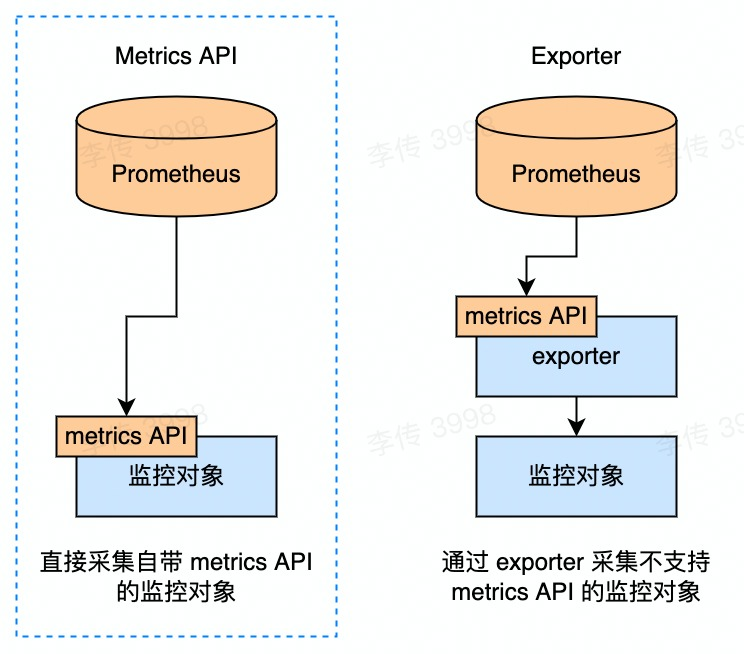
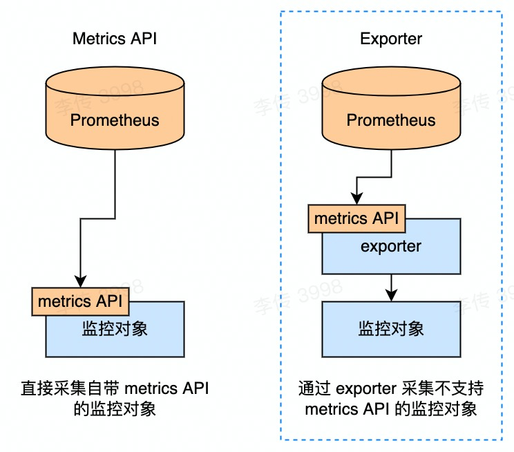

# [PROM-102] 指标采集

<!-- START doctoc generated TOC please keep comment here to allow auto update -->
<!-- DON'T EDIT THIS SECTION, INSTEAD RE-RUN doctoc TO UPDATE -->


- [Metrics API](#metrics-api)
- [Exporter](#exporter)
- [其他方法](#%E5%85%B6%E4%BB%96%E6%96%B9%E6%B3%95)

<!-- END doctoc generated TOC please keep comment here to allow auto update -->

---

前置阅读：[[PROM-101] 初步认识 Prometheus](https://github.com/lichuan0620/k8s-sre-learning-notes/blob/master/prometheus/PROM-101.md)

这篇笔记帮助读者了解 Prometheus 采集指标的原理。这篇笔记不讲解具体怎么做采集配置，但了解采集原理是配好合理的采集配置的重要前提。打算自己开发指标的同学也非常有必要了解这些知识。

文档基于 Prometheus 2.x 版本编写。

## Metrics API



通过 Metrics API 暴露指标，然后由 Prometheus 主动拉取这些指标 —— 这是官方指定的最基本、最普遍的指标采集方式。

这种采集方式中，一个监控目标必须是一个 HTTP 服务。该服务需要按照 Prometheus 格式或者 OpenMetrics 格式把指标数据暴露在 HTTP 接口，即 Metrics API 上，等待 Prometheus 主动通过 HTTP 请求来拉取数据。这里说的 metrics API 通常是用 Prometheus 的 client library 来实现的。

> 各个语言的 client library 通常还会提供该语言的运行时指标，也就是说只要一行代码暴露一下 metrics API 就已经能获得非常丰富的指标了。

配置 Prometheus 采集规则时，一般通过它招牌的服务发现能力来动态加载采集目标。Prometheus 的服务发现机制有非常多种，包括基于 Kubernetes，基于公有云控制面（AWS、GCP、Azure 均支持），基于文件等方式。完整的机制列表可以参考官方文档。本文因为篇幅限制不会涉及服务发现的配置方法，只强调一个点：Prometheus 是可以发现并追踪海量且动态的监控目标的，而这是建立在某种平台的控制面之上来做到的。

总结，被监控对象暴露 metrics API，Prometheus 通过服务发现找到这些服务，循环请求拉取数据。如果不考虑如何开发指标，读到这里就可以跳到下一个章节了。

如果需要开发，那我们继续看。首先讲 Metrics API 的接口格式。Prometheus 支持两种格式的 Metrics API。一种是 Prometheus 自己定义的原生格式，例子如下：

```
# HELP http_request_total Counter of server requests.
# TYPE http_request_total counter
http_request_total{code="200",method="GET",path="/api/v1/query"} 16
http_request_total{code="500",method="GET",path="/api/v1/query"} 8
# HELP http_response_sizes Response content length distribution in bytes.
# TYPE http_response_sizes histogram
http_response_sizes_bucket{method="GET",path="/api/v1/query",le="1000"} 8
http_response_sizes_bucket{method="GET",path="/api/v1/query",le="10000"} 8
http_response_sizes_bucket{method="GET",path="/api/v1/query",le="100000"} 24
http_response_sizes_bucket{method="GET",path="/api/v1/query",le="1e+06"} 24
http_response_sizes_bucket{method="GET",path="/api/v1/query",le="1e+08"} 24
http_response_sizes_bucket{method="GET",path="/api/v1/query",le="+Inf"} 24
http_response_sizes_sum{method="GET",path="/api/v1/query"} 1.05264e+06
http_response_sizes_count{method="GET",path="/api/v1/query"} 24
```

这个格式在官方文档里有说明，但当兴趣阅读就好，因为实际开发中我们肯定是通过 client library 来实现这个接口。
可以看到，原生格式中每个指标会有 # 开头的 header 来标明指标的类型和注释；没有 # 打头的则是数据本身，格式是 metric_name {label_a="value_a", label_b="value_b"} 0.1 。数据内容中没有时间戳，因为这里的预期是暴露在 metrics API 上的数据应该是实时的，拉取时间即数据时间戳。

第二种格式是 OpenMetrics。这是一个开源的暴露指标数据的规范，被 CNCF 承认且现在正在逐渐变得流行。它是在 Prometheus 原生格式之上拓展得来的，和原生格式十分近似，Prometheus 的 client library 也支持。其主要的改进是增加了对 exemplar 和数据时间戳的支持。exemplar 本文不讨论。时间戳解释一下。上文提到原生格式下指标的时间戳是以采集时间为准的，而 OpenMetrics 格式允许开发者手动标明数据的时间戳。注意！一个做法被支持并不代表它是最佳实践。Prometheus 的存储机制是建立在所有数据都是实时数据的基础上的，通过 OpenMetrics 的时间戳功能暴露过老的指标时在很多情况下会造成各种存储问题，建议不熟悉 Prometheus 性能特点的同学不要轻易尝试。
下面是具体的 OpenMetrics 格式的例子。详细解释可以看官方文档，一样只当兴趣阅读就好。

```
# TYPE http_response_sizes histogram
http_response_sizes_bucket{le="0.01"} 0
http_response_sizes_bucket{le="0.1"} 8 # {} 0.054
http_response_sizes_bucket{le="1"} 11 # {trace_id="KOO5S4vxi0o"} 0.67
http_response_sizes_bucket{le="10"} 17 # {trace_id="oHg5SJYRHA0"} 9.8 1520879607.789
http_response_sizes_bucket{le="+Inf"} 17
http_response_sizes_count 17
http_response_sizes_sum 324789.3
http_response_sizes_created  1520430000.123
```

## Exporter



通过 metrics API 暴露指标有一个问题：很多需要监控的对象，比如虚拟机这种 Infra 资源，或者 K8s resource 这种逻辑资源，是无法提供 HTTP 服务的。这个需求引入了第二类采集方式，Exporter，也就是探针。

探针是指一个专门观测别的对象的、把观测到的信息暴露在自己的 metrics API 上的程序。典型的例子包括：

- node_exporter：通过读取 Linux 操作系统写在 /sys和/proc里的内容来暴露虚拟机指标
- kube-state-metrics：通过 list-watch kube-apiserver 来暴露 K8s 资源状态指标
- mysqld_exporter：通过 query MySQL 元数据数据库来暴露 MySQL 运行时指标
  
在如何实现指标和 metrics API 上其实 exporter 是没有任何区别的。Exporter 最大的特点是，它不是一个功能组件在暴露描述自身的指标，而是一个指标的转换器/搬运工。我们也不用刻意划清界限，规定一个程序到底是还是不是一个 exporter，只需要有一个意识：任何具体的或者逻辑上的对象，哪怕无法提供 metrics API，也可以通过 exporter 来对接 Prometheus。

## 其他方法
  
以下方法并不推荐，仅作为补充知识，可以跳过。

__Remote Write__

Remote Write 是 Prometheus 用来在负责采集的实例和负责存储的实例之间批量搬运数据的内部协议。划重点：批量搬运，内部协议。

你可以选择用 Remote Write 协议来直接把数据写到 Prometheus，但这个方式 client library 不支持，同时你也会损失服务发现带来的目标健康监控和元数据注入能力。

__Push Gateway__


Push Gateway 是 Prometheus 提供的一个工具。它的功能是作为一个服务接受别人推过来的指标数据，然后把这些指标数据暴露在自己的 metrics API 上给 Prometheus 采集。Prometheus 的 client library 支持对接 Push Gateway。

官方建议是非特殊情况不要用 Push Gateway；我建议永远不要用 Push Gateway。首先，Push Gateway 没有 HA 方法，官方也不打算支持。其次，它和 Remote Write 一样无法做服务发现。最后，Push Gateway 涉及到计算机科学领域中除了起名外最难的事：缓存失效。尽管它支持 time-to-live 机制和主动注销指标，但基于它管理指标生命周期依然容易变成一场灾难。

__OpenTelemetry__

OpenTelemetry 是目前（2022 年 5 月）除了上述官方采集方法外，唯一推荐的第三方采集协议。如何基于 OpenTelemetry 来采集本身就值得一篇文档，所以这里就不展开了。为想要探索的同学划一些重点：

- OpenTelemetry 是一个跨数据类型的协议，它目前最擅长的其实是 Trace 数据。对于指标来说，它无论是成熟度还是市场占有率还有待提高（也确实在快速提高）。
- OpenTelemetry 是很强的兼容性 - 如果你需要同时使用 Prometheus 和其他引擎，或需要灵活切换，OpenTelemetry 会有一些优势。
- OpenTelemetry 尤其适合没有控制面的场景，比如没有被管控的虚机，边缘计算等。
- OpenTelemetry 很强调可拓展性。高玩可以在采集链路上做一些复杂功能（但也可能让一些初级选手觉得有些眼花缭乱）。
