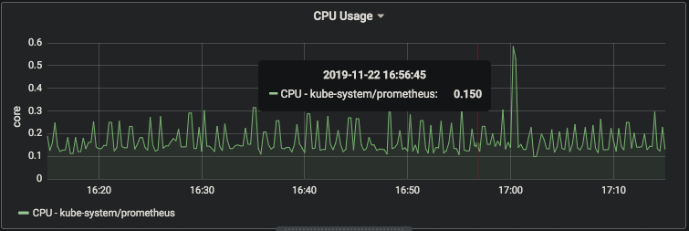
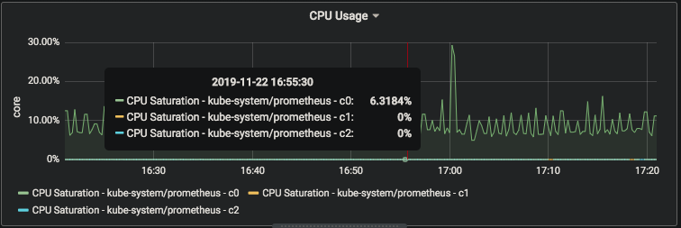
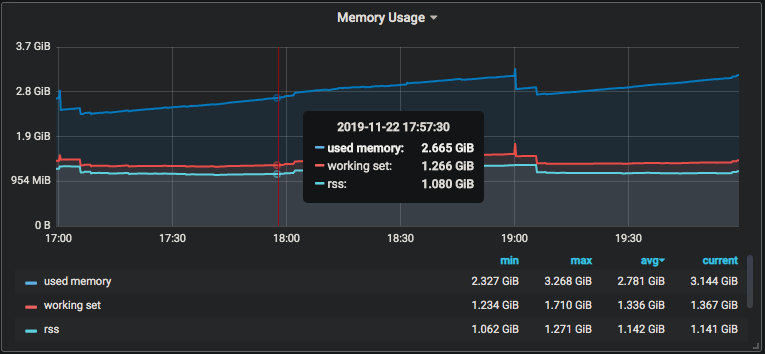

# 常用 Metrics

## 前言

刚接触 Prometheus 时，我被公司 Prometheus 服务器里的 metrics 列表震惊了：这里面没有上千也有大几百个 metrics，难道我要全部理解？！最后事实证明，并不需要。我在负责监控相关功能一年后可能仅使用过其中的一半，而常用的则更少。这篇笔记将总结运维 K8s 集群时最常用的一些 Metrics，解释它们的含义，并讨论它们的最佳用法。

### 阅读前置条件

掌握 PromQL 基本语法；熟悉 container 基本常识；了解 K8s 中 Node, Namespace, 和 Pod 资源。

对 PromQL 有疑问的同学请移步 PromQL 语法相关的笔记，本文不做讲解。在使用任何 metrics 前强烈建议学习一下 PromQL 的技巧和最佳实践！

### 实验前置条件

文中涉及的指标来自 [node-exporter](https://github.com/prometheus/node_exporter), [cAdvisor](https://github.com/google/cadvisor) \(内嵌在 [kubelet](https://kubernetes.io/docs/reference/command-line-tools-reference/kubelet/) 里\)，和 [kube-state-metrics](https://github.com/kubernetes/kube-state-metrics)。

文中查询语句默认 K8s 为推行 [Kubernetes Metrics Overhaul](https://github.com/kubernetes/enhancements/issues/1206) \(即 v1.14.0\) 之后的版本。如有同学碰到涉及 `... ON(...) GROUP_LEFT ...` 的语句查询失败的，可能是因为 K8s 版本过老或做了 relabel 配置导致 metric labels 有变。如果碰到，可使用 [`label_replace`](https://prometheus.io/docs/prometheus/latest/querying/functions/#label_replace) function 修改。

## Container 资源

K8s 中大部分 container metrics 由 cAdvisor 提供，特点是由 `container_` 开头；此外 kube-state-metrics 还补充了一些例如资源配额的 K8s 特有的信息，特点是由 `kube_pod_container_` 开头。

### CPU 用量

Container CPU 用量主要关心 `container_cpu_usage_seconds_total`，即 container CPU 用量。该 metrics 统计的是 CPU 从 `_total` 后缀可以看出它的属性是 counter，即累计值，所以一般配合 `rate` 或 `irate` function 使用。

```text
sum(irate(container_cpu_usage_seconds_total{
    namespace="kube-system", 
    pod="prometheus", 
    container!="",
  }[1m]]
) by (namespace, pod)
```



结合 `kube_pod_container_resource_limits_cpu_cores`，即 container CPU 配额，我们可以计算 container 的 CPU 饱和度：

```text
irate(container_cpu_usage_seconds_total{
    namespace="kube-system", pod="prometheus"
  }[1m]) / ON (namespace, pod, container)
  GROUP_LEFT kube_pod_container_resource_limits_cpu_cores
```



### 内存用量

**TL;DR** container 内存用量主要关心 `container_memory_working_set_bytes`。但内存用量相比 CPU 复杂一些，值得更深入地了解。

首先我们有 `container_memory_rss`，对应 cgroup 中的 `rss` \(resident set size\)，可以通俗地理解为物理内存。其次我们有 `container_memory_usage_bytes`，对应 cgroup 中的 `usage_in_bytes`，即包括 rss 和 cache 的内存总用量。这两个都是很有价值的 metrics，可以帮助我们在分析资源用量、规划资源配置。但更多的时候，我们关系的问题是：我的 container 离 OOM kill 还有多远？

Container 的内存限额，即 cgroup 中的 `limit_in_bytes`，是计算 cache 的，但我们却不能直接用 `container_memory_usage_bytes` 来判断一个 container 什么时候会 OOM - 因为当它的值达到限额时，kernel 会先尝试释放 `inactive_file`，即内存中不活跃 file cache 部分。直到无可释放之后，OOM killer 才会把程序杀掉。而 `container_memory_working_set_bytes` 就是有 `usage_in_bytes` 减去 `inactive_file` 计算得来的；当它达到 limit 时，OOM kill 会立即被执行。K8s 在计算 Available Memory 的时候，使用的也是这个值。



结合 `kube_pod_container_resource_limits_memory_bytes`，即 container 内存配额，我们可以计算 container 的内存饱和度：

```text
container_memory_working_set_bytes{
    namespace="kube-system",  pod="prometheus", container="c0",
  } / ON (namespace, pod, container)
  GROUP_LEFT kube_pod_container_resource_limits_memory_bytes
```

